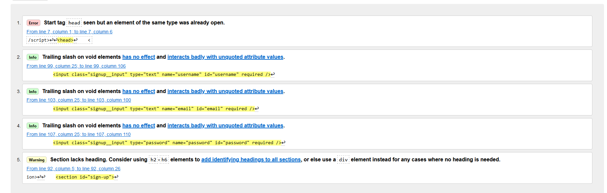

# Leung Wellness Hub
[view the live project here](https://adrianleung5.github.io/Leung-Wellness/)

## Repository
https://github.com/adrianleung5/Leung-Wellness

Leung Wellness serves as an online escape route from everyday stress. The webste serves to enable
like-minded people to relax and invest into their own wellness from the comfort of their own home. The website is open to everyone,from a complete beginer to a experienced practioner and enables them to gain access to various onlne classes through memberships.

## Key Project Goals
- To demonstrate key skills that i have obatined over the course
- To create a well designed website that has a attractive design to users
- To create an interactive website that would enable users to initate and control actions. 
- To create a website for a client aiming to attract users to sign up to their page via a sign up form.

## Brief
The website aims to promote Leungs wellness hub as an a easy way for people to learn body/mind self-improvement techniques as it is accessible online. The following features were identified by the client as the most significant features needed for their site

- A brief and easy to interpret explanation of what the site entails
- An eye catching design for website with releavent images to wellness
- A sign up form for users to subscribe and join the virtual wellness hub
- Links to the clients various social media to enable visitors to find more information
- A bried explanation of the different types of classes on available to members

# Target Audience
Sport people, fitness enthuasists, mental health , people working from home, people from all age groups, parents.

# UX user Experience

## First Time Visitor Goals
-  As a first-time visitor, I would like to understand the website's objective and understand to obtain further information as simply as possible. 
- As a first time visitor, I would like to be able to navigate through the website easily and without any problems.

## Returning User Goals
- As a returning customer, I would like to find out more information about the classes and prices.
- As a returning customer, I would like to be able to navigate the website on various different platforms without any issues.

## Frequent User Goals
- As a frequent user, I would like to see if there are new classes available on the website
- As a frequent user, I would like to see if there is any changes in prices or any new membership options.

## Initial Concept
- The navigation aspect of the website was inspured by [ALO moves.com](https://www.alomoves.com/)
- The about us section of the webisite was inspired by [Arden Wellness Hub](https://www.ardenwellnesshub.com/about)
- The sign up and footer section of the website was inspired by  [Codes Coders Coffeehouse](https://codeinstitute.net/ie/)

# Site Structure
Leung Wellness is a 1 page website with three. The home page is the default loading page. the other pages are accessible from the navigation menu at all times.

# Typography
The two fonts used were imported into the css from google fonts. The font style was taken from 
[here](https://www.fontpair.co/all). This site identified the two fonts Merriweather and working sans as two complimentry fonts. 

# Color scheme
The color scheme used on this website was based from the hero image. [Coolors.co](https://coolors.co/) was used to identify the colors asoosicated with the hero image. Coolors.co identified the color black shadows and baby pink as some of the colors associated with the hero image. The color white was used to provide color contrast to the site. In this website these colors for the text block , sign up form and the hover feartures. The selection of colors associated with the hero image can be seen below.

# Features
Navigation
- At the top of the page , the client logo is dsplayed in the top left corner as "Leung Wellness". This links to the top of the page
- The navigation links on the top right corner consists of About us, class info and Sign up. These all link to different sections of the page
- The font style for this website was inspired from [here](https://www.fontpair.co/all)
- The naviation clearly illiustrates the clients logo and the different sections of the website

# Text block
- The text block illistates the purpose of the website by stating that it is a virtual wellnesshub based in Dublin
- The textblock contains a button which is linked to the sign up form section of the website.
- The button on the text block will also change to baby pink when the button is hovered on.
- The Text block is positoned over a section of the hero image.

# About us Section
- The about section gives us a brief explanation of what the hub offers its members. It means the cost of membership and provides a contact email address.
- The about us section shows users what classes and services area abailable to memmbers in a list. - The design of the list of availble classes with the tick boxes was   taken from [Toptal.com](https://www.toptal.com/designers/htmlarrows/symbols/heavy-check-mark)
- The about us also has an image on the left of a person in medidation pose. This is highly aligned with the theme of the website.

# Sign up form
- The form in the sign-up area asks users for information so they can subscribe to the Wellness hub. Once the fill in the relevant information they may enter their details to the client by pressing the "join now button".
- The form requires users to create a username, enter their email and to create a password. Users may not be able to select the join now button unless these fields are filled.
- Once the user selects clicks the sign up button they will be redirected to an external page which informs them that they have signed up for membership.

# The contact section
- The contact Section provides social media icons to enable website users to locate the clients social media pages.
- The contact us section is essential as it clearly illustrates to the website users where to get more information and how to make contact with the client.

# Technolohgies used
- [HTML5](https://html.spec.whatwg.org/)
- [CSS](https://www.w3.org/Style/CSS/Overview.en.html)
- [Gitpod](https://www.gitpod.io/)
- [Github](https://github.com/)
- [Google Fonts](https://github.com/TashaTJ/pawsome-portraits-v4#technologies-used)
- [Font Awesome ](https://fontawesome.com/)
- [Google chrome dev tools](https://developer.chrome.com/docs/devtools/)
- [Am i responsive](https://ui.dev/amiresponsive)
- [Coolors.co](https://coolors.co/)
- [Unsplashed](https://unsplash.com/)

# Testing
Testing user stories
- The website is easy to naviate and naviation menu, about us section and sign up form are easily to read and follow
- The Sign up form is interactive. It requires users to fill in username, email and password details.
- The form will redicrect to an external page when sign up button is clicked which will confirm users have signed up.
- When the menu items are selected it brings users to the relevant seciton of the site.

## Responsivness
- The website was tested on different browsers such as Google chrome, firefox.
-  The site [Am i responsive](https://ui.dev/amiresponsive) was used to test the repsonsiveness of the website.
-  Responsivness of the site was also tested by [Google chrome dev tools](https://developer.chrome.com/docs/devtools/). This allowed us to check the sizes of different screens using various screen sizes such as small, medium, large phone screens and laptop sized screens.

# A11y Color Contrast Accessibility Checker
 - Colour contrast tests were carried out across the website and all came back without issue as shown here [Ally Color Contrast Accessiblty 
 
 

# Bugs

## Resolved bugs

During the validation the following bugs occured.

- Errors 2-5 were resolved were resolved by removing the closing tag from the input element from the form.
- Error 1 was resolved by moving the script below the head tag.
- Error 5 was fixed by changing the section to a div.

## Unresolved bugs
- No unfixed bugs

# Deployment
The site was deployed to Github pages
- Navitgate to the settings tab of the Github repository via [Github repository](https://github.com/adrianleung5/Leung-Wellness).
- Select pages tab on the left side of the page under code and automation.
- Under source, select "deploy from a branch" and then click ‘save’.
- Page will refresh, Return to the repository page and you will a "github-pages active" icon under enviornment on the right side of the page.

# To Fork the Repository
- Go into Github and select the fork icon on the top right.

# Create a local clone
- Log into Github and go to the repository.Click on the ‘code’ tab beside the gitpod button.
- Select the clipboard icon
- In your IED open GitBash
- Change the current working directory to the location you want the cloned directory to be made.
- Type ‘git clone’ and then paste the URL copied from GitHub.
- press enter and the local clone will be created.

# Credits
## Content
- The navigation aspect of the website was inspured by [ALO moves.com](https://www.alomoves.com/)
- The about us section of the webisite was inspired by [Arden Wellness Hub](https://www.ardenwellnesshub.com/about)
- The content for the About us section was taken [Arden Wellness Hub](https://www.ardenwellnesshub.com/about)
- The content in the textbox wask taken from [ALO moves.com](https://www.alomoves.com/)
- The sign up and footer section of the website was inspired by  [Codes Coders Coffeehouse](https://codeinstitute.net/ie/)
- Inspiration for the README.md came from [Tasha Johnsons repoistory](https://github.com/TashaTJ/pawsome-portraits-v4#technologies-used)
- Icons from footer taken from [Font Awesome ](https://fontawesome.com/)

## Media
- All photos taken from [Unsplashed](https://unsplash.com/)
-  The social media icons was taken from [Font Awesome ](https://fontawesome.com/)

## Code 
- I found a lot of useful tutorials online. I occasionally applied principles from them to the site after thoroughly understanding their code and modifying it to meet the needs of the site.

- I found [Kevin Powell channel](https://www.youtube.com/kevinpowell) and [W3schools.com](https://www.w3schools.com/) really insightful in helping me understand and manipulate code to suit the site.
- Aspects of the sign up and footer section of the website was inspired by  [Codes Coders Coffeehouse](https://codeinstitute.net/ie/)
- The code of the list of availble classes in the about us section with the tick boxes was taken from [Toptal.com](https://www.toptal.com/designers/htmlarrows/symbols/heavy-check-mark)
- The naviation links for the different section of the website was inspired from [Love Running](https://github.com/Code-Institute-Solutions/love-running-2.0-sourcecode/tree/main/08-responsive-elements/02-responsive-header)
- The styling of the sign up form was inspired by [Sitepoint.com](https://www.sitepoint.com/community/t/translate-x-but-no-scroll-wanted/372432)
- The code for resonsive element of the contact us section was inspired from. [tutorialspoint.com](https://www.tutorialspoint.com/html/html_email_links.htm)
- The code applied for the script was taken from [W3schools.com](https://www.w3schools.com/tags/att_script_crossorigin.asp#:~:text=Definition%20and%20Usage&text=A%20cross%2Dorigin%20request%20is,to%20manage%20cross%2Dorigin%20requests.)
- 

